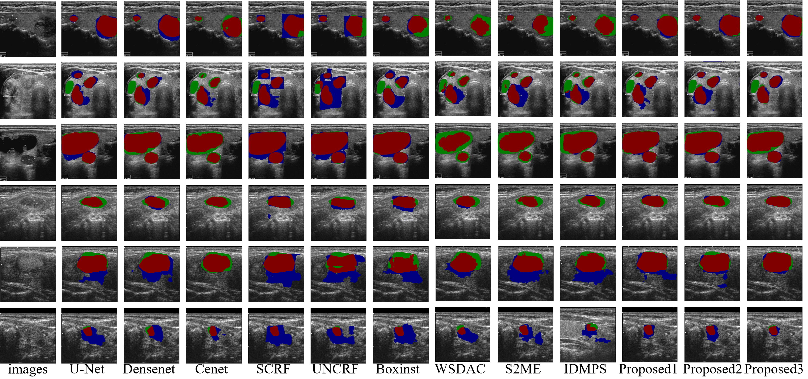

# HCL-HRL
The point annotations scribbled by experts will be public when the article is accepted!!

Welcome to the official repository for the paper: "MultiConSeg: Weakly Supervised Framework for Thyroid Nodule Segmentation Based on Multi-level Constraints Learning."

<div style="text-align: center;">
  
</div>

## Results visualization
<div style="text-align: center;">
  
</div>

**Segmentation results.** our proposed method effectively addresses these challenges through two key innovations: (1) the generation of high-confidence labels to mitigate label noise and improve training stability, and (2) the introduction of a high-rationality loss function designed to capture location-level, region-level, and edge-level features for segmentation location and shape learning. These advancements are integrated into our proposed framework, showing comparable or even surpassing results to those of fully supervised networks, demonstrating its robustness and effectiveness in addressing the unique challenges posed by thyroid ultrasound image segmentation.


## Environment Requirements

To run this project, ensure you have the following software installed:
- Python 3.7 or higher
- PyTorch 1.8 or higher

You can create a virtual environment and install the required packages with:

```bash
# Create a new conda environment
conda create -n your_env_name python>=3.7

# Activate the conda environment
conda activate your_env_name

# Install PyTorch and torchvision
pip install torch torchvision  # Adjust according to your CUDA version
```

# Install MedSAM
```bash
git clone https://github.com/bowang-lab/MedSAM
cd MedSAM
pip install -e .
```

## Dataset Preparation
```bash
The dataset structure required for this network should be organized as follows:
├── main
├── models
├── utils
├── data/          # the dataset folder
    ├── train      # train dataset
        ├── imgs    
        ├── gt      
        └── labels  # point labels .json
    ├── val        # val and test dataset
        ├── imgs
        ├── gt
        └── labels
```

## Dataset Preprocessing
Before training, you need to preprocess the dataset using the point labels to generate the dissimilarity prior and multi-level labels. The generated prior and labels will be saved at the same folder level as the 'imgs'.

Run the following command to preprocess the dataset:
```bash
python utils/data_pre.py --data_name "your prepocess dataset"
```
Replace "your_preprocess_dataset" with the name of your dataset.

## Training the Network
To train the network, use the following command:
```bash
python main/train.py --arch "model name " --dataset "dataset name" --epochs "training epochs"
```

## Inference
To perform inference with the trained model, use the following command:
```bash
python main/inference.py --arch "model name " --train "the model trained on which dataset" --dataset "inference dataset name" --epochs "training epochs"
```
Replace the placeholders:
"model_name": The name of the model architecture.
"trained_model_name": The name of the model that was trained on the dataset.
"inference_dataset_name": The name of the dataset you want to run inference on.
"training_epochs": The number of epochs for which the model was trained.

## License
This project is licensed under the MIT License.

## Citation
If you use this code in your research, please cite our paper:
```
@article{chi2024Weakly,
  title={Weakly Supervised Segmentation Framework for Thyroid Nodule Based on High-confidence Labels and High-rationality Losses},
  author={Jianning Chi, Zelan Li, Geng Lin, MingYang Sun, Xiaosheng Yu},
  journal={arXiv preprint arXiv:2502.19707},
  year={2025}
}
```
